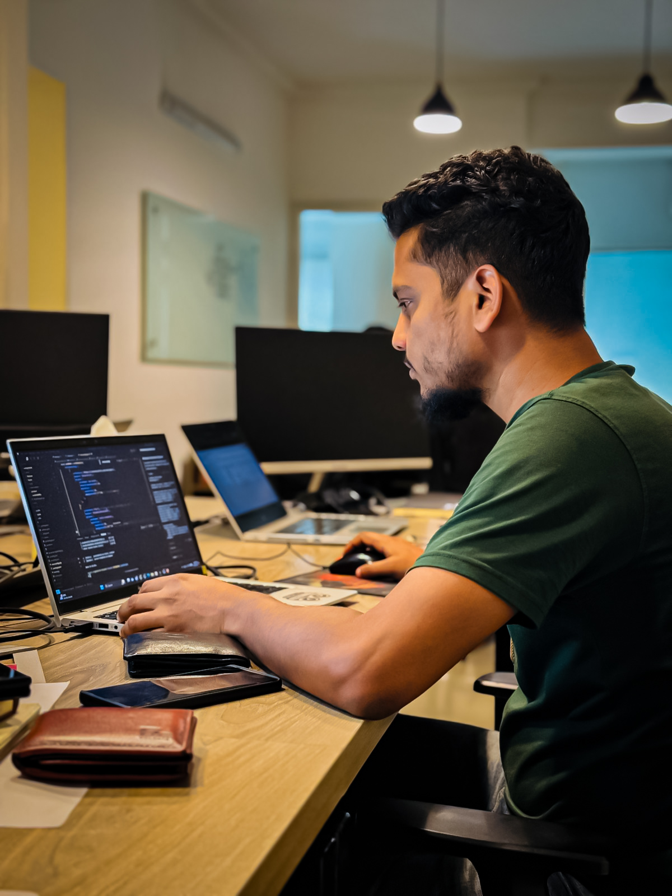

# ⚡ Jahid Hasan - Developer Portfolio

A premium, high-performance developer portfolio built with **Next.js 16**, **Tailwind CSS**, and **Supabase**. Featuring a unique **VS Code-inspired UI**, a fully integrated **CMS Dashboard**, and ultra-fast navigation.



## ✨ Key Features

- **💻 VS Code UI Architecture**: A pixel-perfect recreation of the Visual Studio Code interface, including an Activity Bar, Sidebar Explorer, Tabbed Navigation, and a dynamic Status Bar.
- **🛠️ Integrated CMS Dashboard**: A powerful administrative interface to manage projects, blogs, skills, and profile information without touching the code.
- **📝 Advanced Blog System**: 
  - Rich-text editing with Tiptap.
  - Real-time search and category-wise filtering.
  - On-demand Incremental Static Regeneration (ISR) for instant updates.
- **🎨 Multi-Theme Support**: Seamlessly switch between **Dark**, **Light**, and **Darcula** modes with persistent storage.
- **🚀 Performance Optimized**: 
  - Sub-second page transitions using Link Prefetching.
  - On-demand cache revalidation (`revalidatePath`).
  - Optimized image delivery via Supabase Storage.
- **📱 Fully Responsive**: Tailored experiences for Mobile, Tablet, and Desktop, including a custom mobile hamburger menu system.

## 🛠️ Tech Stack

- **Framework**: [Next.js 16 (App Router)](https://nextjs.org/)
- **Styling**: [Tailwind CSS](https://tailwindcss.com/)
- **Database & Storage**: [Supabase](https://supabase.com/)
- **Authentication**: HTTP-only dashboard session cookie
- **Typography**: Plus Jakarta Sans, Syne, Inter, Fira Code
- **Icons**: Heroicons
- **Deployment**: [Vercel](https://vercel.com/)

## 🚀 Getting Started

### 1. Clone the repository
```bash
git clone https://github.com/your-username/portfolio.git
cd portfolio
```

### 2. Install dependencies
```bash
npm install
```

### 3. Environment Setup
Create a `.env.local` file in the root directory and add your credentials:

```env
# Supabase
NEXT_PUBLIC_SUPABASE_URL=your_supabase_url
NEXT_PUBLIC_SUPABASE_ANON_KEY=your_anon_key
SUPABASE_SERVICE_ROLE_KEY=your_service_role_key

# Admin Credentials
ADMIN_EMAIL=your_email
ADMIN_PASSWORD=your_password
```

### 4. Run the development server
```bash
npm run dev
```

Next.js will use the first available default port. To choose any local port explicitly:

```bash
npm run dev -- -p 4173
```

No application URL or port environment variable is required for local development.

## 📂 Project Structure

- `src/app/(portfolio)`: Public-facing routes (Home, About, Projects, etc.).
- `src/app/dashboard`: Administrative interface for content management.
- `src/app/api`: Server-side API handlers with cache revalidation.
- `src/components/vscode`: Core VS Code UI components.
- `src/components/pages`: Main page sections and logic.
- `src/lib/supabase`: Database client and storage utilities.

## 🛡️ Security & Authentication
The dashboard is protected via **NextAuth.js** middleware. Only authorized administrators can access the CMS to manage projects and articles. Database interactions are secured via Supabase Row Level Security (RLS) where applicable.

## 📄 License
This project is licensed under the MIT License - see the [LICENSE](LICENSE) file for details.

---
Built with ❤️ by [Jahid Hasan](https://devjahid.vercel.app)
